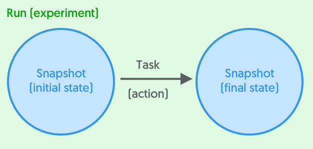
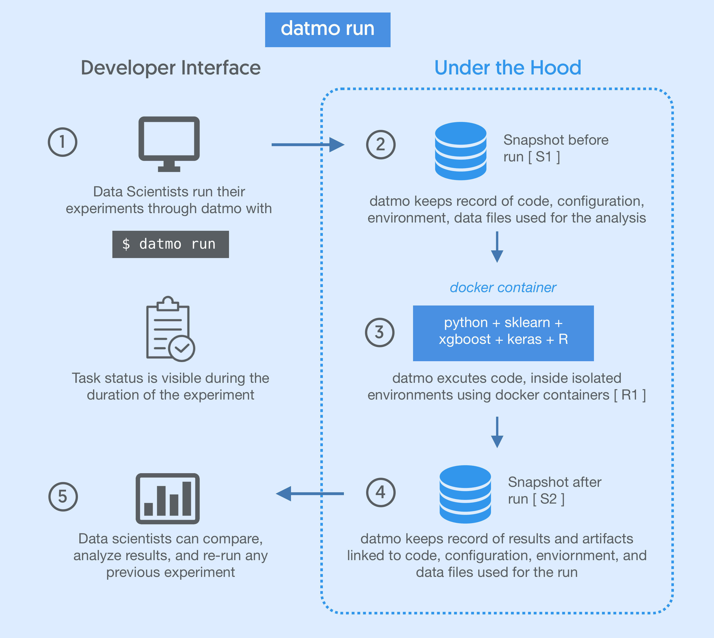

Datmo Concepts
===================================

Environments
-------------

**Environments** contain the hardware and software necessary for running code. These involve everything from programming languages, language-level packages/libraries, operating systems, and GPU drivers. Users can store multiple environments and choose which to use at the time of a task run.

You can setup environments on initialization with ``$ datmo init`` or at any point in time using ``$ datmo environment setup``

Workspaces
------------

**Workspaces** are interactive programming environments/IDE's. Depending on which environment is chosen during setup, there are a handful of workspaces that are available out of the box including:
    - Jupyter Notebook via ``$ datmo notebook``
    - RStudio via ``$ datmo rstudio``
    - JupyterLab via ``$ datmo jupyterlab``
    - Terminal via ``$ datmo terminal``

Runs
--------------

A **run** is comprised of *tasks* and *snapshots*. In Datmo's paradigm, states (snapshots) represent nodes, and tasks represent edges, in this case actions that are applied to states. 

Each run contains the initial state (snapshot), followed by the action that was performed to it (task), as well as the final state of the repository (another snapshot).

For a typical use case, this would appear as follows:

You can view all of your past runs at any time with ``$ datmo run ls``

You can replicate a run at any time with the ``$ datmo rerun`` command.

Tasks
---------

**Tasks** are command line actions or commands a user can perform within a project. For example, the commands ``python train.py`` or ``python predict.py`` would both be examples of tasks. Tasks are declarative entities and are applied to states (snapshots) to form execute runs.

.. _snapshots:

Snapshots
-------------

For recording state, we have our own fundamental unit called a **Snapshot**. This enables the user to have a single point of reference for the model version, rather than having to worry about individually tracking each component. Snapshots contain five components, each of which is logged at the time of Snapshot creation simultaneously. When performing runs, snapshots are autogenerated to help you autosave your work.

- **Source code** is managed between snapshot versions automagically inside of a hidden ``.datmo`` folder that the user never has to interact with. Users can 

- **Environment** (dependencies, packages, libraries, system env) are stored in environment files (typically Dockerfiles) for containerized task running and reproducibility on other systems. Datmo also currently autogenerates a `requirements.txt` file based on the packages imported by Python scripts in the repository.

- **Files** include visualizations, model weights files, datasets, and any other files present at the time of snapshot creation. For versioning models, large datasets or weights files are recommended to be stored as pointers to external sources in the _config_ property. 

- **Configurations** are properties which alter your experiments (such as variable hyperparameters). Configurations are user defined, which can include (but are not limited to) algorithm type, framework, hyperparameters, external file locations, database queries, and more.

- **Metrics** are the values that help you assess your model (e.g. validation accuracy, training time, loss function score). These can be passed in from a memory-level variable/object in the Python SDK, or manually as a file or value via the CLI for all other languages.